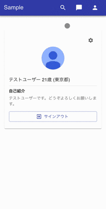
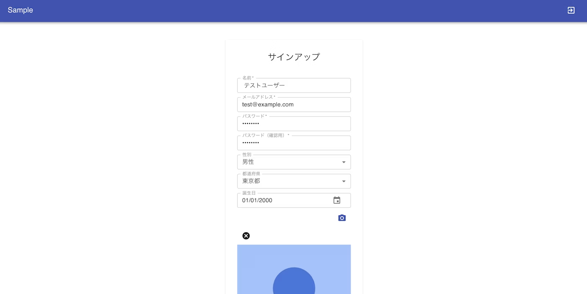
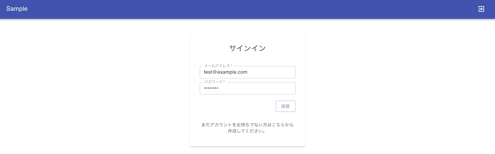
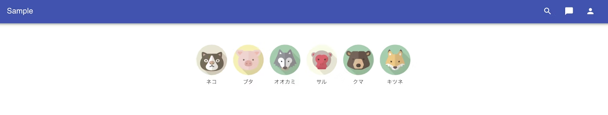
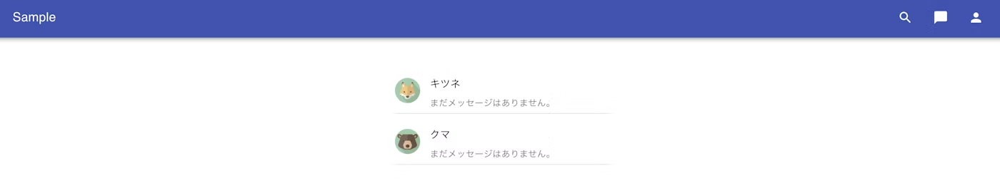

***マッチングアプリケーションの機能一覧***

- サインアップ機能
    - 入力内容
        - 名前
        - メールアドレス
        - パスワード
        - 性別
        - 都道府県
        - 誕生日
        - プロフィール画像
    
- サインイン機能
    - エラー（サインインに失敗した時）
        - アラートメッセージが表示される
    
- ホームページ
    - 表示される内容
        - 自身の詳細情報
        - サインアウトボタン
        - 設定ボタン
    
- ユーザー一覧機能
    - ユーザー登録した画像が表示される
    - 特定のユーザーをクリックするとモーダルが開く
        - ユーザー詳細情報が見る事ができる
            - 表示される内容
                - ユーザー名
                - ユーザー画像
                - 自己紹介の文章
                - いいねボタン
    
- マッチング一覧
    - いいねしたユーザーとのチャット機能
    
