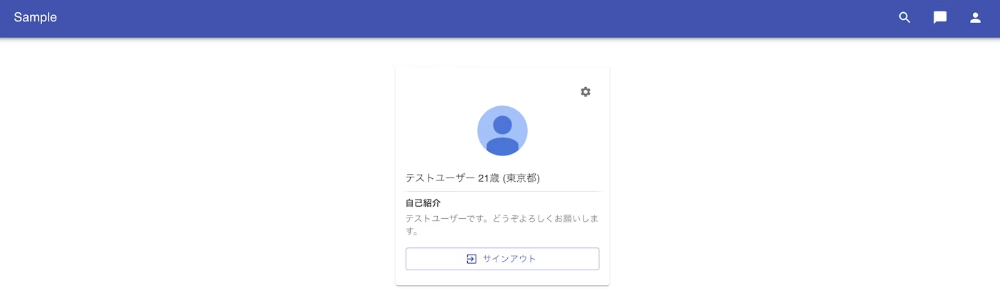

- UIの整理
    - ホームページ
        - 表示される内容
            - 設定ボタン
            - 自身の詳細情報
                - ユーザーが自身で登録した画像
                - ユーザー名
                - 年齢
                - 都道府県情報
                - 自己紹介文
            - サインアウトボタン
        
    - ユーザーの状態
        - ログインしている状態
            - ログインしている状態の定義
                - session情報
                - トークン => Cookies
                    - access-token
                    - client
                    - uid
                - isSignedIn => true
                - currentUser => res.data.data
                    - これらが定義されている状態 => ログイン済みの状態

- historyオブジェクトによってレンダーされる => react-router-dom

- homeコンポーネント
    - 表示される内容
        - 設定ボタン(編集機能)
            - IconButtonコンポーネントにラップされたSettingsIcon
                - IsonButtonにonClick関数が紐づいており、クリックされるとeditFormOpenがtrueに変わる
                    - trueに変わるとDialogがopenになりモーダルが表示されるようになる
            - FormタグにラップされたDialog(モーダル)
                - editFormOpenがtrueの時に表示される    
                    - onClose関数にはsetEditFormOpenに初期値がfalseである関数が発火するようになっている
                - DialogTitle => プロフィールの変更
                - DialogContent
                    - TextField => name
                        - onChange関数が紐づいている
                    - FormControl
                        - InputLabelを紐づける
                            - InputLabelのid部分にはSelectコンポーネントを紐づける
                                - Select => onChange関数が紐づく
                                    - 配列prefecturesに対してmap関数を実行したものを表示する
                                        - keyとvalueに関してはindexに＋１する => 0~46ではなく1~47で表示する
                    - TextField => 自己紹介
                        - onChange関数が紐づ
                    - input => 画像登録するコンポーネント
                        - onChange
                            - uploadImage(e)
                            - previewImage(e)
                        - previewする画像がある場合には表示する
                    - DialogActionsコンポーネント
                        - onClick
                            - handleSubmit関数が紐づく
                - handleSubmit
                    - eventに対してpreventDefaultを呼ぶ
                        - 変数dataを定義する
                            - createFormData
                                - 新しく入力された入力内容を反映する
                                    - 非同期処理でAPIを叩く
                                        - もし、statusコードが200で帰ってきたら(成功したら)
                                            - setEditFormOpenにfalseを渡す(モーダルを閉じる)
                                            - setCurrentUserにaxiosのレスポンスのuserプロパティを渡す
                                        - 成功しなかった場合にはコンソールにエラーメッセージを表示する
        - 自身の詳細情報
            - ユーザーが自身で登録した画像
                - Grid itemコンポーネントでラップされたAvatarコンポーネント
                    - srcにcurentUserに?をつけて画像登録がない場合の対応をする
                        - プレビュー画面はpreviewImageでcreateObjectURLを使ってプレビュー画面を生成するための一時的なURLを作成する
            - ユーザーのテキスト情報
                - テキストを表示するためのコンポーネントであるTypographyでラップする
                    - 特別なStateなどを持たない、いわゆるPresentational Component
                        - ユーザー名
                            - {currentUser?.name}
                                - ログイン済みのはずだが名前の登録がなかった場合にエラーになるので対策する
                        - 年齢
                            - {currentUserAge()}歳
                                - サインアップの時に登録した誕生日(birthday)を使い年齢を計算するコンポーネント
                            - currentUserAge
                                - 変数birthdayを定義する
                                    - currentUserのbirthdayプロパティを受け取る
                                    - 受け取った値を文字列に変換する
                                    - replaceメソッドを使って空白文字と-を入れ替える
                                - if文 => もし、birthdayの長さが8ではない場合にはreturn(処理を終わらせる)
                                - 変数dataを定義する
                                    - Dateクラスのオブジェクトを生成する
                                - 変数todayを定義する
                                    - date.getFullYear() => 与えた値の年に相当する部分を返す
                                    - (date.getMonth() + 1)
                                        - 与えた値の月に相当する値を0~11の値の中で返す
                                        - 月で表示したいため+1する
                                        - .slice(-2)
                                            - 配列date.getMonthの後ろ2つの要素を取得してシャローコピーする
                                    - date.getDate()
                                        - 指定された日付の日を返す
                                        - .slice(-2)
                                            - 配列date.getDateの後ろ2つの要素を取得してシャローコピーする
                                    - 最終的に変数dataは年月日付(計8文字)になる
                                - Math.floor()
                                    - 与えられた数値以下の整数を返す
                                        - 特定の値の整数部分のみを返す
                                    - 引数には(parseInt(today) - parseInt(birthday) / 10000)を渡す
                                        - parseInt
                                            - 指定された値の整数値を返す
                                                - 年齢の値が求まる
                        - 都道府県情報
                            - 都道府県情報は数値で管理している
                                - 登録した時には1~47の値で管理するためにindex番号に+1した
                                    - そのため表示する際にindex番号を取得する際に-1する事で正しい値を取得する事ができる
                        - 自己紹介文
                            - currentUser.profileに対して3項演算子である?を使ってprofileプロパティがtrueの場合currentUser.profileを表示するfalseの場合、”よろしくお願いいたします。”を表示する
        - サインアウトボタン
            - Botton
                - onClick関数にhandleSignOut関数が紐づいている
                    - handleSignOut
                        - asyncで非同期処理が実行される
                            - evetの型はReactモジュールのinterfaceで定義されているMouseEvent<HTMLButtonElement>
                        - try,catch文でエラーハンドリングする
                            - 変数resを定義する
                                - signOut関数を実行する
                        - signOut
                            - clientにdeleteメソッドでauth/sign_outでAPIを叩く
                            - 第二引数にはヘッダー情報を渡す
                                - 叩かれるリクエストhttp://localhost:3001/api/v1/auth/sign_out
        - BE
            - sessionコントローラーで認証の確認を行う
        - FE
            - axios内部でresponseとして返されるデータはこのように定義されている
            ```JavaScript
            utils.forEach(['delete', 'get', 'head', 'options'], function forEachMethodNoData(method) {
            /*eslint func-names:0*/
            Axios.prototype[method] = function(url, config) {
                return this.request(mergeConfig(config || {}, {
                method: method,
                url: url,
                data: (config || {}).data
                }));
            };
            });
            ```
            - このdataプロパティにsuccesが入ると考える
                - deletaメソッドでサーバーのリソースの削除に成功した場合
                    - Cookiesに対してremoveメソッドを実行してデータを削除する
                    - setIsSignedInにfalseを渡してcontextで管理しているisSignedInをfalseに更新する
                    - histroyオブジェクトにpush関数を使い、signinを履歴スタックに追加する
                    - コンソールに"Succeeded in sign out"を出力する
                - もし、リソースの削除に失敗した場合にはコンソールに"Failed in sign out"を出力する
            - catch構文でエラーが発生している場合にはコンソールにエラーを出力する

- Issue
    - history.push("/signin")
        - これがソースコードだとhistroy.push("/signin")になっている
            - したがってconst history = useHistory()もスペルミスしている

- コールグラフ
    - homeコンポーネント
        - isSignedIn => true
        - currentUser => true
            - IconButton
                - setEditFormOpen
            - Avatar
                - src={currentUser?.image.url}
            - Typography
                - {currentUser?.name}
                - {currentUserAge()}
                - ({currentUserPrefecture()})
            - currentUser.profile => true if false => nil
                - Typography
                    - {currentUser.profile}
            - Button => サインアウト
                - handleSignOut
            - form
                - open => editFormOpen
                - onClose => setEditFormOpen()
                    - TextField
                        - onChange => setName
                    - InputLabel
                        - Select
                            - MenuItem
                                - prefecture
                    - TextField
                        - onChange
                    - input
                        - onChange
                            - uploadImage(e)
                            - previewImage(e)
                    - preview => true
                        - IconButton => プレビュー表示
                            - img
                                - src={preview}
            - DialogActions
                - Button
                    - onClick => handleSubmit